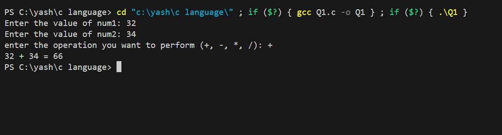
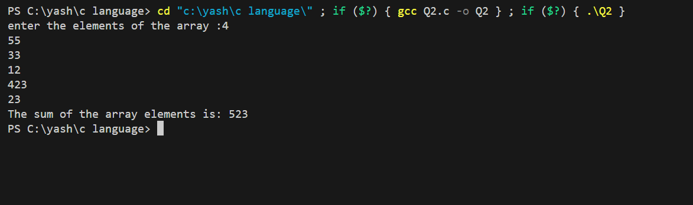
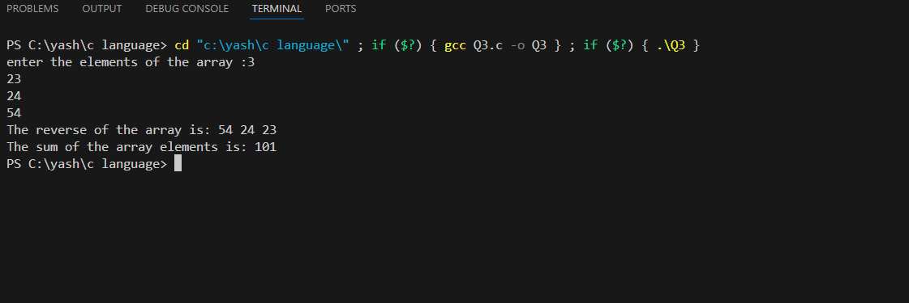
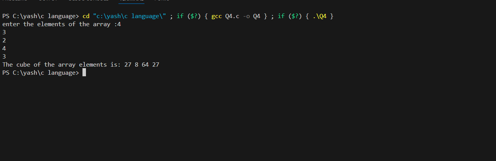
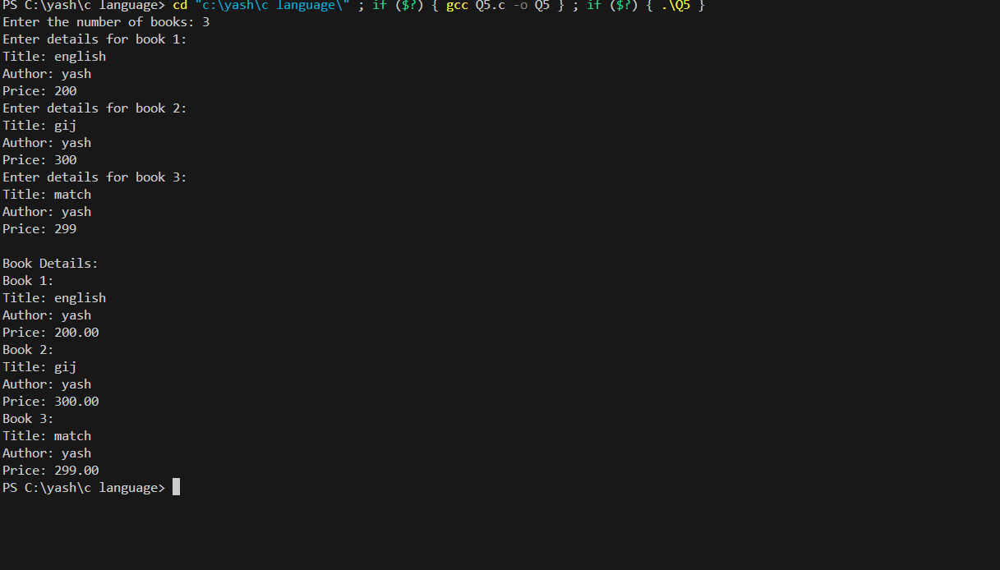
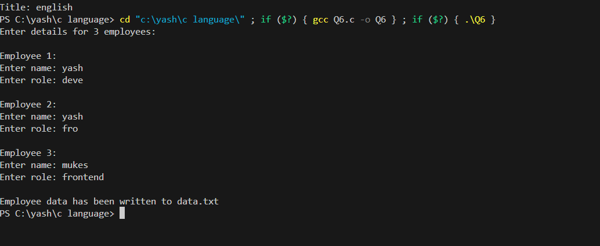
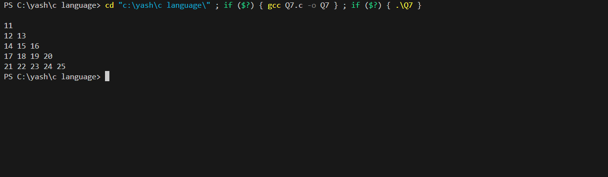

1.Implement a C program to simulate a simple calculator that performs addition, subtraction, multiplication, and division based on user input.

2.Write a C program to find the sum of elements in an array using a function.

3.Write a C program that defines a function to print a reverse 1D array elements and print sum of all elements.

4.Write a C program to find cube of each elements of an 1D array using Pointer.

5.Develop a C program that uses structures to represent a book (with attributes like title, author, and price). List N number of books' details using Array of objects.

6.Write a C program that writes any 3 employees' name along with their role(designation) in a file called data.txt by taking input from user dynamically.

7.Print a below pattern using nested for loop in C language:
11
12 13
14 15 16
17 18 19 20
21 22 23 24 25

